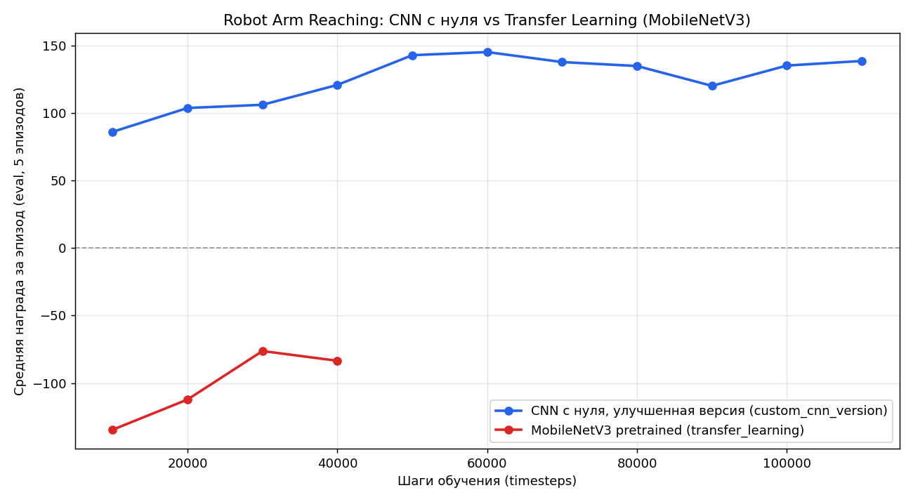

# RL_PyBullet — Robot Arm Reaching: три подхода к vision-based RL

Робот-манипулятор **Franka Panda** в [PyBullet](https://pybullet.org/) учится дотягиваться схватом до случайно расположенного кубика на столе — по изображению с камеры, а не по "читерским" координатам. Эта ветка — сравнение трёх разных стратегий обучения агента на пикселях с использованием **Stable-Baselines3 (PPO)**.

> Другие ветки этого репозитория — более ранние итерации той же линии экспериментов: табличный Q-Learning на всё более сложных задачах навигации. См. [`main`](../../tree/main) и [`dev`](../../tree/dev), а также [`simple_1d_qlearning/`](simple_1d_qlearning) в этой ветке — самая первая, одномерная версия.

## Задача

- **Робот:** Franka Panda, управление через дельту позиции схвата (`Δx, Δy, Δz`) + инверсная кинематика
- **Наблюдение:** grayscale-изображение 64×64 с камеры над столом + углы 7 суставов (проприоцепция)
- **Действие:** непрерывное, 3 числа — смещение схвата
- **Награда (после ребаланса):** `(1 − distance_norm) + 2×progress + 5×contact`, с клипом в [-10, 10] — плотная (dense), а не разреженная: агент получает сигнал на каждом шаге, а не только в момент касания
- **Инфраструктура:** Gymnasium-совместимая среда (`robot_env.py`), Frame Stacking (4 кадра для передачи динамики), векторизация через `DummyVecEnv`, чекпоинты и `EvalCallback` каждые 10k шагов

Обучение на сырых пикселях с нуля — известная сложная задача (низкая sample efficiency, разреженная награда). Эта ветка — экспериментальное сравнение трёх способов сделать её решаемой за разумное число шагов.

## Три подхода

### 1. `custom_cnn_version/` — CNN с нуля (baseline)

Собственный feature extractor (`SmallConvExtractor`, 3 свёрточных слоя 32→64→128) поверх пиксельного входа, обучается **с нуля вместе с политикой PPO**, 600k шагов. Контрольная точка — без какого-либо переноса знаний. Подробности архитектуры — в [`custom_cnn_version/README.md`](custom_cnn_version/README.md).

### 2. `transfer_learning/` — Transfer Learning (MobileNetV3)

Вместо обучения свёрток с нуля — **замороженная MobileNetV3-Small**, предобученная на ImageNet, в роли извлекателя признаков. Первый свёрточный слой пересобран под 12 каналов (4 кадра × RGB) с переносом весов через `repeat` вместо случайной инициализации.

### 3. `curriculum_learning/` — Curriculum Learning + перенос весов ("хирургия мозга")

Двухэтапная схема:
1. **Учитель** обучается на **привилегированной информации** — точных координатах цели вместо пикселей (`train_teacher.py`, PPO + MlpPolicy, быстро благодаря простому входу).
2. **Студент** получает архитектуру с CNN-веткой под пиксели, и в него **вручную копируются веса Учителя** послойно, где размерности совпадают (`train_student.py`) — прежде чем начать самостоятельное дообучение на пикселях.

Идея: научить агента "что делать" на лёгкой версии задачи, а затем перенести эту политику в сложную (visual) версию вместо обучения с нуля вслепую.

## Результаты



| Подход | Шагов обучения | Средняя награда (лучший чекпоинт) |
|---|---|---|
| CNN с нуля (после ребаланса награды) | 110 000+ | **≈ +145** (шаг 60k), стабильно положительная |
| Transfer Learning (MobileNetV3) | 40 000 *(обучение прервано раньше плана, на старой sparse-награде)* | −134 → −76, устойчивый рост, но ещё не пересчитано на новой награде |
| Curriculum — Учитель (координаты) | ~65 000 | ≈ −90…−116, шумно |
| Curriculum — Студент (пиксели, веса перенесены + дообучен) | 240 000 (чекпоинт `student_resumed_240000_steps`) | дообучение продолжено, отдельная кривая не финализирована |

**Что изменилось:** изначальная разреженная награда (`-distance + 100×contact`) почти не давала сигнала агенту и не сходилась. После перехода на плотную награду (`(1-distance) + 2×progress + 5×contact`, см. выше) и более глубокую CNN тот же baseline-подход **реально решает задачу** — награда стабильно держится в положительной зоне ≈ +120…+145 уже к 60k шагов, вместо −258 на 320k шагов раньше. Transfer Learning и Curriculum пока не пересчитаны на новой награде — сравнение с ними сейчас нечестное (яблоки с апельсинами), это следующий шаг.

## Что здесь отрабатывалось

- Проектирование Gym/Gymnasium-среды под робота-манипулятора: камера, IK-контроль, sparse reward на контакте
- PPO из Stable-Baselines3: `MultiInputPolicy`, кастомные `BaseFeaturesExtractor`, векторизация сред, Frame Stacking
- Три техники ускорения vision-RL: CNN с нуля / transfer learning с заморозкой весов / privileged-information curriculum с ручным переносом весов между сетями разной архитектуры
- Логирование через TensorBoard, `CheckpointCallback` и `EvalCallback` для сравнимых метрик между подходами

## Запуск

```bash
pip install gymnasium stable-baselines3 torch torchvision pybullet opencv-python numpy

# Baseline — CNN с нуля
cd custom_cnn_version && python train.py

# Transfer learning — MobileNetV3
cd transfer_learning && python train.py

# Curriculum — сначала учитель, потом студент
cd curriculum_learning
python train_teacher.py
python train_student.py
```

Визуальная проверка обученной модели — `test.py` / `test_teacher.py` в соответствующей папке (открывает GUI PyBullet и прогоняет несколько эпизодов).

## Статус

Экспериментальная ветка, продолжение проекта из `main`/`dev` — переход от табличного Q-Learning на простой задаче навигации к PPO на задаче манипулятора с обучением по изображению. Baseline (CNN с нуля) после ребаланса награды **уже решает задачу**. Следующий шаг — пересчитать Transfer Learning и Curriculum на той же плотной награде, чтобы сравнение трёх подходов было честным.
