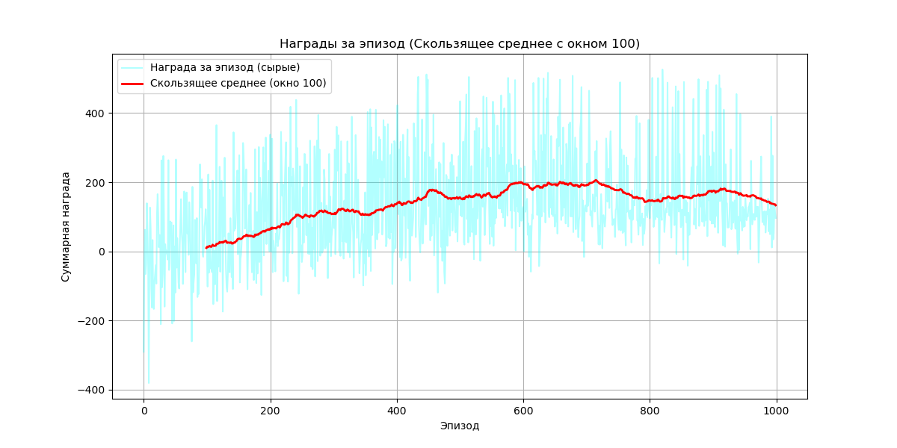

# RL_PyBullet

Робот Husky учится доезжать до случайно заданной цели в физическом симуляторе [PyBullet](https://pybullet.org/), используя табличный **Q-Learning**.



## Идея

На каждом эпизоде цель спавнится в случайной точке в радиусе `MAX_TARGET_SPAWN_RADIUS` от робота. Агент не видит карту напрямую — он получает только **дистанцию до цели** и **угол на цель относительно своего курса**, дискретизированные в сетку `10 × 10` состояний. Из этого состояния агент выбирает одно из 5 действий (вперёд, назад, разворот влево/вправо, стоп) и обновляет Q-таблицу по стандартной формуле:

```
Q[s,a] ← Q[s,a] + α · (r + γ · max(Q[s']) − Q[s,a])
```

## Архитектура

Код разделён на слои, чтобы среда, агент и расчёты не путались друг с другом:

```
train.py                  — точка входа: обучение + демонстрация
config.py                 — все параметры симуляции, среды, наград и обучения в одном месте
src/
├── agent/
│   └── q_agent.py         — Q-Learning агент (epsilon-greedy, обновление таблицы)
└── environment/
    ├── base_env.py         — "дирижёр": собирает всё ниже в интерфейс reset()/step()
    ├── simulation.py        — подключение к PyBullet, шаг физики
    ├── robot.py              — управление колёсами Husky, чтение позиции/угла
    ├── task.py                — спавн и проверка достижения цели
    ├── state.py                — вычисление (дистанция, угол) из сырых координат
    ├── reward.py                — расчёт награды за шаг
    └── discretizer.py            — перевод непрерывного состояния в бины Q-таблицы
utils.py                  — построение графика наград (training_rewards.png)
```

`robot_env.py` в корне — более ранняя, монолитная версия среды (весь PyBullet-код в одном классе), оставлена для истории до перехода на модульную версию в `src/environment/`.

## Пространство действий

5 дискретных действий, пары скоростей левого/правого колеса:

| # | Действие | (v_left, v_right) |
|---|---|---|
| 0 | Вперёд | (6.0, 6.0) |
| 1 | Назад | (-6.0, -6.0) |
| 2 | Разворот влево | (-3.0, 3.0) |
| 3 | Разворот вправо | (3.0, -3.0) |
| 4 | Стоп | (0, 0) |

## Награда

```
R = (dist_old − dist_new) × 100 − turn_penalty + goal_bonus
```

- Приближение к цели даёт положительную награду, удаление — отрицательную (умножено на 100, чтобы сигнал не терялся на фоне шума).
- Разворот на месте (действия 2/3) штрафуется небольшим `TURN_PENALTY_FACTOR`, чтобы робот не "танцевал" вместо движения к цели.
- Достижение цели (`distance < 0.3`) даёт бонус `+10`.

## Обучение

Гиперпараметры (`config.py`):

| Параметр | Значение |
|---|---|
| Эпизодов | 1000 |
| Макс. шагов в эпизоде | 250 |
| α (learning rate) | 0.5 |
| γ (discount factor) | 0.99 |
| ε: старт → конец | 1.0 → 0.01, спад за первые 75% эпизодов |

`train.py` работает в два этапа:

1. **Обучение** — 1000 эпизодов без GUI (быстрее), каждые 100 эпизодов печатается средняя награда. По завершении сохраняется график `training_rewards.png`.
2. **Демонстрация** — 10 эпизодов с включённым GUI, `epsilon = 0` (агент действует по уже выученной политике, без исследования).

## Запуск

```bash
pip install pybullet numpy matplotlib
python train.py
```

При первом запуске PyBullet подтянет `plane.urdf` и `husky/husky.urdf` из своего стандартного набора моделей (`pybullet_data`).

## Статус

Учебный проект по Reinforcement Learning — рабочая связка среда/агент/обучение на табличном Q-Learning. Хорошая база для дальнейшего расширения: continuous-state подход (DQN) вместо дискретизации, более сложная сцена с препятствиями, другой робот.
